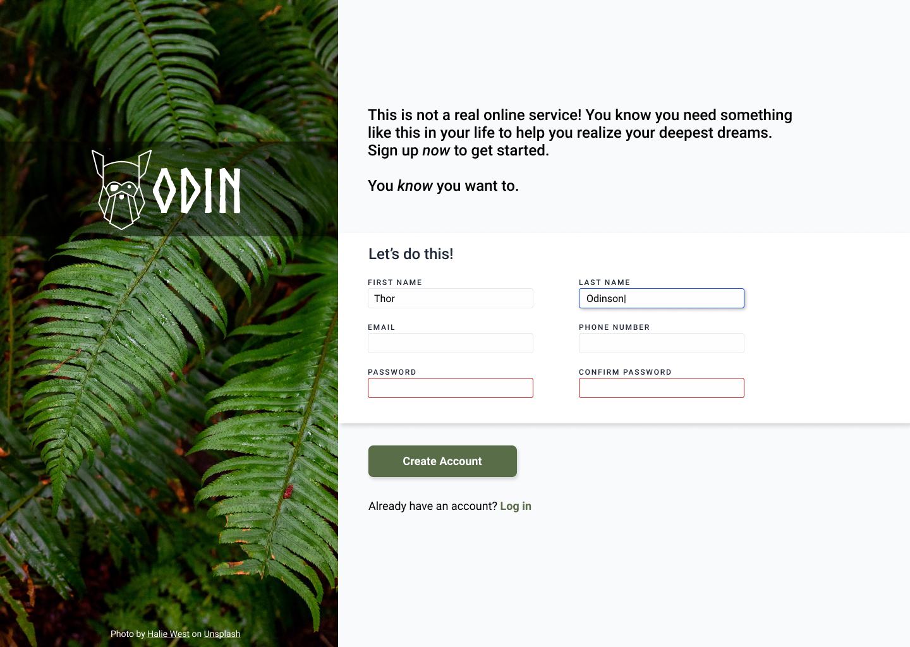

# A very simple sign up form design.

This is an exercise from the Odin Project's _Intermediate HTML and CSS section_.

The form is not responsive and lacks real functionality, as the purpose of the exercise is to practice the basics of HTML form elements and CSS styling.

The design was created by following an example provided by the Odin Project:

You can view the live form [Here]()

